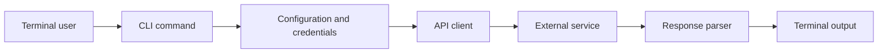

<!-- unified-readme:start -->
<div align="center">

# MOCO CLI

**CLI tool for interacting with the MOCO project management and time tracking API.**

Build. Automate. Share.

[](https://github.com/JayRHa/MocoCLI/stargazers)
[](https://github.com/JayRHa/MocoCLI/network/members)
[](https://github.com/JayRHa/MocoCLI/issues)
[](https://github.com/JayRHa/MocoCLI/graphs/contributors)

---

`CLI Tool` | `Python` | `Public` | `Maintained`

</div>

## What is this?

MOCO CLI wraps a service or workflow in a command-line interface so common tasks can be automated from a terminal, shell script, or scheduled job.

## Project Context

- Primary stack: Python.
- Typical usage starts with local configuration or credentials, then executes commands against the target service API.
- This repository is maintained as a practical project and reference asset.

## How It Works

The CLI parses user input, loads configuration, calls the external service, normalizes the response, and prints script-friendly output.



## Quick Start

1. Review the project context and workflow below.
2. Clone the repository:

   ```bash
   git clone https://github.com/JayRHa/MocoCLI.git
   ```

3. Continue with the project-specific documentation in the next section.

---
<!-- unified-readme:end -->

<!-- project-documentation:start -->
## Project Documentation

The sections below contain the repository-specific setup, usage, and reference material for this project.

<div align="center">
  <h1>MOCO CLI</h1>
  <p><strong>Ein vollstaendiger, skriptbarer CLI-Zugang zur gesamten dokumentierten MOCO API (inkl. Impersonation).</strong></p>
  <p>
    
    
    
    
  </p>
</div>

## Overview

`moco` ist ein generisches High-Signal CLI fuer die MOCO API mit:

- vollstaendigem Endpoint-Katalog aus der offiziellen Doku (Snapshot: `2026-02-18`)
- flexiblen API-Aufrufen ueber Endpoint-Key oder direkt per `--method/--path`
- voller Unterstuetzung fuer Query-Parameter, Path-Parameter und JSON-Body
- Impersonation per `X-IMPERSONATE-USER-ID`
- sauberem JSON-Output fuer Automatisierung

## 60-Second Quickstart

```bash
python3 -m venv .venv
source .venv/bin/activate
python3 -m pip install -e .

export MOCO_API_KEY="<YOUR_API_KEY>"
export MOCO_DOMAIN="mycompany"

moco endpoints --method GET --limit 10
moco call --method GET --path /profile
moco call --endpoint get-profile
```

## Why It Feels Great To Use

- Ein Kommando fuer alles: `moco`
- Vollstaendiger Endpoint-Katalog direkt in der CLI
- Striktes Input-Validation mit klaren Fehlern
- Menschlich lesbare Ausgabe plus stabiles JSON
- Gut geeignet fuer CI, Shell-Skripte und `jq`

## Install

```bash
python3 -m pip install -e .
```

## Authentication

Entweder per Flag:

```bash
moco --api-key "<KEY>" --domain mycompany call --method GET --path /profile
```

Oder per Env:

```bash
export MOCO_API_KEY="<KEY>"
export MOCO_DOMAIN="mycompany"
moco call --method GET --path /profile
```

Optional:

```bash
export MOCO_BASE_URL="https://mycompany.mocoapp.com/api/v1"
export MOCO_IMPERSONATE_USER_ID="123"
```

## Command Matrix

| Command | Purpose | Common flags |
| --- | --- | --- |
| `endpoints` | Dokumentierte MOCO-Endpunkte anzeigen/filtern | `--method --section --contains --limit --show-source --json` |
| `call` | Beliebigen Endpunkt ausfuehren | `--endpoint` oder `--method --path`, `--path-param`, `--query`, `--body`, `--output`, `--json` |

## Help

```bash
moco --help
moco endpoints --help
moco call --help
```

Alle Endpoint-Keys kannst du live mit `moco endpoints` sehen.

## Alle Endpoint-Commands (249)

<details>
<summary>Vollstaendige Liste aufklappen</summary>

| Key | Method | Path |
| --- | --- | --- |
| `get-account-catalog_services` | `GET` | `/account/catalog_services` |
| `get-account-catalog_services-id` | `GET` | `/account/catalog_services/{id}` |
| `post-account-catalog_services` | `POST` | `/account/catalog_services` |
| `put-account-catalog_services-id` | `PUT` | `/account/catalog_services/{id}` |
| `delete-account-catalog_services-id` | `DELETE` | `/account/catalog_services/{id}` |
| `get-account-catalog_services-service_id-items-id` | `GET` | `/account/catalog_services/{service_id}/items/{id}` |
| `post-account-catalog_services-service_id-items` | `POST` | `/account/catalog_services/{service_id}/items` |
| `put-account-catalog_services-service_id-items-id` | `PUT` | `/account/catalog_services/{service_id}/items/{id}` |
| `delete-account-catalog_services-service_id-items-id` | `DELETE` | `/account/catalog_services/{service_id}/items/{id}` |
| `get-account-custom_properties` | `GET` | `/account/custom_properties` |
| `get-account-custom_properties-id` | `GET` | `/account/custom_properties/{id}` |
| `post-account-custom_properties` | `POST` | `/account/custom_properties` |
| `patch-account-custom_properties-id` | `PATCH` | `/account/custom_properties/{id}` |
| `delete-account-custom_properties-id` | `DELETE` | `/account/custom_properties/{id}` |
| `get-account-expense_templates` | `GET` | `/account/expense_templates` |
| `get-account-expense_templates-id` | `GET` | `/account/expense_templates/{id}` |
| `post-account-expense_templates` | `POST` | `/account/expense_templates` |
| `put-account-expense_templates-id` | `PUT` | `/account/expense_templates/{id}` |
| `delete-account-expense_templates-id` | `DELETE` | `/account/expense_templates/{id}` |
| `get-account-fixed_costs` | `GET` | `/account/fixed_costs` |
| `get-account-hourly_rates` | `GET` | `/account/hourly_rates` |
| `get-account-internal_hourly_rates` | `GET` | `/account/internal_hourly_rates` |
| `patch-account-internal_hourly_rates` | `PATCH` | `/account/internal_hourly_rates` |
| `get-account-task_templates` | `GET` | `/account/task_templates` |
| `get-account-task_templates-id` | `GET` | `/account/task_templates/{id}` |
| `post-account-task_templates` | `POST` | `/account/task_templates` |
| `put-account-task_templates-id` | `PUT` | `/account/task_templates/{id}` |
| `delete-account-task_templates-id` | `DELETE` | `/account/task_templates/{id}` |
| `get-activities` | `GET` | `/activities` |
| `get-activities-id` | `GET` | `/activities/{id}` |
| `post-activities` | `POST` | `/activities` |
| `post-activities-bulk` | `POST` | `/activities/bulk` |
| `put-activities-id` | `PUT` | `/activities/{id}` |
| `patch-activities-id-start_timer` | `PATCH` | `/activities/{id}/start_timer` |
| `patch-activities-id-stop_timer` | `PATCH` | `/activities/{id}/stop_timer` |
| `delete-activities-id` | `DELETE` | `/activities/{id}` |
| `post-activities-disregard` | `POST` | `/activities/disregard` |
| `get-comments` | `GET` | `/comments` |
| `get-comments-id` | `GET` | `/comments/{id}` |
| `post-comments` | `POST` | `/comments` |
| `post-comments-bulk` | `POST` | `/comments/bulk` |
| `put-comments-id` | `PUT` | `/comments/{id}` |
| `delete-comments-id` | `DELETE` | `/comments/{id}` |
| `get-companies` | `GET` | `/companies` |
| `get-companies-id` | `GET` | `/companies/{id}` |
| `post-companies` | `POST` | `/companies` |
| `put-companies-id` | `PUT` | `/companies/{id}` |
| `delete-companies-id` | `DELETE` | `/companies/{id}` |
| `put-companies-id-archive` | `PUT` | `/companies/{id}/archive` |
| `put-companies-id-unarchive` | `PUT` | `/companies/{id}/unarchive` |
| `get-contacts-people` | `GET` | `/contacts/people` |
| `get-contacts-people-id` | `GET` | `/contacts/people/{id}` |
| `post-contacts-people` | `POST` | `/contacts/people` |
| `put-contacts-people-id` | `PUT` | `/contacts/people/{id}` |
| `delete-contacts-people-id` | `DELETE` | `/contacts/people/{id}` |
| `get-deal_categories` | `GET` | `/deal_categories` |
| `get-deal_categories-id` | `GET` | `/deal_categories/{id}` |
| `post-deal_categories` | `POST` | `/deal_categories` |
| `put-deal_categories-id` | `PUT` | `/deal_categories/{id}` |
| `delete-deal_categories-id` | `DELETE` | `/deal_categories/{id}` |
| `get-deals` | `GET` | `/deals` |
| `get-deals-id` | `GET` | `/deals/{id}` |
| `post-deals` | `POST` | `/deals` |
| `put-deals-id` | `PUT` | `/deals/{id}` |
| `delete-deals-id` | `DELETE` | `/deals/{id}` |
| `get-users-employments` | `GET` | `/users/employments` |
| `post-users-employments` | `POST` | `/users/employments` |
| `get-users-employments-id` | `GET` | `/users/employments/{id}` |
| `put-users-employments-id` | `PUT` | `/users/employments/{id}` |
| `delete-users-employments-id` | `DELETE` | `/users/employments/{id}` |
| `get-users-holidays` | `GET` | `/users/holidays` |
| `get-users-holidays-id` | `GET` | `/users/holidays/{id}` |
| `post-users-holidays` | `POST` | `/users/holidays` |
| `put-users-holidays-id` | `PUT` | `/users/holidays/{id}` |
| `delete-users-holidays-id` | `DELETE` | `/users/holidays/{id}` |
| `get-invoices-bookkeeping_exports` | `GET` | `/invoices/bookkeeping_exports` |
| `get-invoices-bookkeeping_exports-id` | `GET` | `/invoices/bookkeeping_exports/{id}` |
| `post-invoices-bookkeeping_exports` | `POST` | `/invoices/bookkeeping_exports` |
| `get-invoices-payments` | `GET` | `/invoices/payments` |
| `get-invoices-payments-id` | `GET` | `/invoices/payments/{id}` |
| `post-invoices-payments` | `POST` | `/invoices/payments` |
| `post-invoices-payments-bulk` | `POST` | `/invoices/payments/bulk` |
| `delete-invoices-payments-id` | `DELETE` | `/invoices/payments/{id}` |
| `get-invoice_reminders` | `GET` | `/invoice_reminders` |
| `get-invoice_reminders-id` | `GET` | `/invoice_reminders/{id}` |
| `post-invoice_reminders` | `POST` | `/invoice_reminders` |
| `delete-invoice_reminders-id` | `DELETE` | `/invoice_reminders/{id}` |
| `post-invoice_reminders-id-send_email` | `POST` | `/invoice_reminders/{id}/send_email` |
| `get-invoices` | `GET` | `/invoices` |
| `get-invoices-locked` | `GET` | `/invoices/locked` |
| `get-invoices-id` | `GET` | `/invoices/{id}` |
| `get-invoices-id-pdf` | `GET` | `/invoices/{id}.pdf` |
| `get-invoices-id-timesheet` | `GET` | `/invoices/{id}/timesheet` |
| `get-invoices-id-timesheet-pdf` | `GET` | `/invoices/{id}/timesheet.pdf` |
| `get-invoices-id-expenses` | `GET` | `/invoices/{id}/expenses` |
| `put-invoices-id-update_status` | `PUT` | `/invoices/{id}/update_status` |
| `post-invoices` | `POST` | `/invoices` |
| `post-invoices-id-send_email` | `POST` | `/invoices/{id}/send_email` |
| `delete-invoices-id` | `DELETE` | `/invoices/{id}` |
| `get-invoices-id-attachments` | `GET` | `/invoices/{id}/attachments` |
| `post-invoices-invoice_id-attachments` | `POST` | `/invoices/{invoice_id}/attachments` |
| `delete-invoices-invoice_id-attachments-id` | `DELETE` | `/invoices/{invoice_id}/attachments/{id}` |
| `get-offers-id-customer_approval` | `GET` | `/offers/{id}/customer_approval` |
| `post-offers-id-customer_approval-activate` | `POST` | `/offers/{id}/customer_approval/activate` |
| `post-offers-id-customer_approval-deactivate` | `POST` | `/offers/{id}/customer_approval/deactivate` |
| `get-offers` | `GET` | `/offers` |
| `get-offers-id` | `GET` | `/offers/{id}` |
| `get-offers-id-pdf` | `GET` | `/offers/{id}.pdf` |
| `post-offers` | `POST` | `/offers` |
| `put-offers-id-assign` | `PUT` | `/offers/{id}/assign` |
| `put-offers-id-update_status` | `PUT` | `/offers/{id}/update_status` |
| `post-offers-id-send_email` | `POST` | `/offers/{id}/send_email` |
| `get-offers-id-attachments` | `GET` | `/offers/{id}/attachments` |
| `post-offers-id-attachments` | `POST` | `/offers/{id}/attachments` |
| `delete-offers-offer_id-attachments-id` | `DELETE` | `/offers/{offer_id}/attachments/{id}` |
| `get-planning_entries` | `GET` | `/planning_entries` |
| `get-planning_entries-id` | `GET` | `/planning_entries/{id}` |
| `post-planning_entries` | `POST` | `/planning_entries` |
| `put-planning_entries-id` | `PUT` | `/planning_entries/{id}` |
| `delete-planning_entries-id` | `DELETE` | `/planning_entries/{id}` |
| `get-users-presences` | `GET` | `/users/presences` |
| `get-users-presences-id` | `GET` | `/users/presences/{id}` |
| `post-users-presences` | `POST` | `/users/presences` |
| `post-users-presences-touch` | `POST` | `/users/presences/touch` |
| `put-users-presences-id` | `PUT` | `/users/presences/{id}` |
| `delete-users-presences-id` | `DELETE` | `/users/presences/{id}` |
| `get-profile` | `GET` | `/profile` |
| `get-projects-id-contracts` | `GET` | `/projects/{id}/contracts` |
| `get-projects-id-contracts-id` | `GET` | `/projects/{id}/contracts/{id}` |
| `post-projects-id-contracts` | `POST` | `/projects/{id}/contracts` |
| `put-projects-id-contracts-id` | `PUT` | `/projects/{id}/contracts/{id}` |
| `delete-projects-id-contracts-id` | `DELETE` | `/projects/{id}/contracts/{id}` |
| `get-projects-id-expenses` | `GET` | `/projects/{id}/expenses` |
| `get-projects-id-expenses-id` | `GET` | `/projects/{id}/expenses/{id}` |
| `post-projects-id-expenses` | `POST` | `/projects/{id}/expenses` |
| `post-projects-id-expenses-bulk` | `POST` | `/projects/{id}/expenses/bulk` |
| `put-projects-id-expenses-id` | `PUT` | `/projects/{id}/expenses/{id}` |
| `delete-projects-id-expenses-id` | `DELETE` | `/projects/{id}/expenses/{id}` |
| `post-projects-id-expenses-disregard` | `POST` | `/projects/{id}/expenses/disregard` |
| `get-projects-expenses` | `GET` | `/projects/expenses` |
| `get-projects-groups` | `GET` | `/projects/groups` |
| `get-projects-groups-id` | `GET` | `/projects/groups/{id}` |
| `get-projects-payment_schedules` | `GET` | `/projects/payment_schedules` |
| `get-projects-project_id-payment_schedules` | `GET` | `/projects/{project_id}/payment_schedules` |
| `get-projects-project_id-payment_schedules-id` | `GET` | `/projects/{project_id}/payment_schedules/{id}` |
| `post-projects-project_id-payment_schedules` | `POST` | `/projects/{project_id}/payment_schedules` |
| `put-projects-project_id-payment_schedules-id` | `PUT` | `/projects/{project_id}/payment_schedules/{id}` |
| `delete-projects-project_id-payment_schedules-id` | `DELETE` | `/projects/{project_id}/payment_schedules/{id}` |
| `get-recurring_expenses` | `GET` | `/recurring_expenses` |
| `get-projects-id-recurring_expenses` | `GET` | `/projects/{id}/recurring_expenses` |
| `get-projects-id-recurring_expenses-id` | `GET` | `/projects/{id}/recurring_expenses/{id}` |
| `post-projects-id-recurring_expenses` | `POST` | `/projects/{id}/recurring_expenses` |
| `put-projects-id-recurring_expenses-id` | `PUT` | `/projects/{id}/recurring_expenses/{id}` |
| `post-projects-id-recurring_expenses-id-recur` | `POST` | `/projects/{id}/recurring_expenses/{id}/recur` |
| `delete-projects-id-recurring_expenses-id` | `DELETE` | `/projects/{id}/recurring_expenses/{id}` |
| `get-projects-id-tasks` | `GET` | `/projects/{id}/tasks` |
| `get-projects-id-tasks-id` | `GET` | `/projects/{id}/tasks/{id}` |
| `post-projects-id-tasks` | `POST` | `/projects/{id}/tasks` |
| `put-projects-id-tasks-id` | `PUT` | `/projects/{id}/tasks/{id}` |
| `delete-projects-id-tasks-id` | `DELETE` | `/projects/{id}/tasks/{id}` |
| `delete-projects-id-tasks-destroy_all` | `DELETE` | `/projects/{id}/tasks/destroy_all` |
| `get-projects` | `GET` | `/projects` |
| `get-projects-assigned` | `GET` | `/projects/assigned` |
| `get-projects-id` | `GET` | `/projects/{id}` |
| `post-projects` | `POST` | `/projects` |
| `put-projects-id` | `PUT` | `/projects/{id}` |
| `delete-projects-id` | `DELETE` | `/projects/{id}` |
| `put-projects-id-archive` | `PUT` | `/projects/{id}/archive` |
| `put-projects-id-unarchive` | `PUT` | `/projects/{id}/unarchive` |
| `get-projects-id-report` | `GET` | `/projects/{id}/report` |
| `put-projects-id-share` | `PUT` | `/projects/{id}/share` |
| `put-projects-id-disable_share` | `PUT` | `/projects/{id}/disable_share` |
| `put-projects-id-assign_project_group` | `PUT` | `/projects/{id}/assign_project_group` |
| `put-projects-id-unassign_project_group` | `PUT` | `/projects/{id}/unassign_project_group` |
| `get-purchases-bookkeeping_exports` | `GET` | `/purchases/bookkeeping_exports` |
| `get-purchases-bookkeeping_exports-id` | `GET` | `/purchases/bookkeeping_exports/{id}` |
| `post-purchases-bookkeeping_exports` | `POST` | `/purchases/bookkeeping_exports` |
| `get-purchases-budgets` | `GET` | `/purchases/budgets` |
| `get-purchases-categories` | `GET` | `/purchases/categories` |
| `get-purchases-categories-id` | `GET` | `/purchases/categories/{id}` |
| `get-purchases-drafts` | `GET` | `/purchases/drafts` |
| `get-purchases-drafts-id` | `GET` | `/purchases/drafts/{id}` |
| `get-purchases-drafts-id-pdf` | `GET` | `/purchases/drafts/{id}.pdf` |
| `delete-purchases-drafts-id` | `DELETE` | `/purchases/drafts/{id}` |
| `get-purchases-payments` | `GET` | `/purchases/payments` |
| `get-purchases-payments-id` | `GET` | `/purchases/payments/{id}` |
| `post-purchases-payments` | `POST` | `/purchases/payments` |
| `post-purchases-payments-bulk` | `POST` | `/purchases/payments/bulk` |
| `delete-purchases-payments-id` | `DELETE` | `/purchases/payments/{id}` |
| `get-purchases` | `GET` | `/purchases` |
| `get-purchases-id` | `GET` | `/purchases/{id}` |
| `post-purchases` | `POST` | `/purchases` |
| `put-purchases-id` | `PUT` | `/purchases/{id}` |
| `post-purchases-id-assign_to_project` | `POST` | `/purchases/{id}/assign_to_project` |
| `patch-purchases-id-update_status` | `PATCH` | `/purchases/{id}/update_status` |
| `patch-purchases-id-store_document` | `PATCH` | `/purchases/{id}/store_document` |
| `delete-purchases-id` | `DELETE` | `/purchases/{id}` |
| `get-receipts` | `GET` | `/receipts` |
| `get-receipts-id` | `GET` | `/receipts/{id}` |
| `post-receipts` | `POST` | `/receipts` |
| `patch-receipts-id` | `PATCH` | `/receipts/{id}` |
| `delete-receipts-id` | `DELETE` | `/receipts/{id}` |
| `get-report-absences` | `GET` | `/report/absences` |
| `get-report-cashflow` | `GET` | `/report/cashflow` |
| `get-report-finance` | `GET` | `/report/finance` |
| `get-report-planned_vs_tracked` | `GET` | `/report/planned_vs_tracked` |
| `get-report-utilization` | `GET` | `/report/utilization` |
| `get-schedules` | `GET` | `/schedules` |
| `get-schedules-id` | `GET` | `/schedules/{id}` |
| `post-schedules` | `POST` | `/schedules` |
| `put-schedules-id` | `PUT` | `/schedules/{id}` |
| `delete-schedules-id` | `DELETE` | `/schedules/{id}` |
| `get-taggings` | `GET` | `/taggings` |
| `patch-taggings` | `PATCH` | `/taggings` |
| `put-taggings` | `PUT` | `/taggings` |
| `delete-taggings` | `DELETE` | `/taggings` |
| `get-tags` | `GET` | `/tags` |
| `get-tags-id` | `GET` | `/tags/{id}` |
| `post-tags` | `POST` | `/tags` |
| `put-tags-id` | `PUT` | `/tags/{id}` |
| `delete-tags-id` | `DELETE` | `/tags/{id}` |
| `get-units` | `GET` | `/units` |
| `get-units-id` | `GET` | `/units/{id}` |
| `post-units` | `POST` | `/units` |
| `put-units-id` | `PUT` | `/units/{id}` |
| `delete-users-id` | `DELETE` | `/users/{id}` |
| `get-users-roles` | `GET` | `/users/roles` |
| `get-users` | `GET` | `/users` |
| `get-users-id` | `GET` | `/users/{id}` |
| `post-users` | `POST` | `/users` |
| `put-users-id` | `PUT` | `/users/{id}` |
| `delete-users-id-2` | `DELETE` | `/users/{id}` |
| `get-users-id-performance_report` | `GET` | `/users/{id}/performance_report` |
| `get-vat_code_sales` | `GET` | `/vat_code_sales` |
| `get-vat_code_purchases` | `GET` | `/vat_code_purchases` |
| `get-vat_code_sales-id` | `GET` | `/vat_code_sales/{id}` |
| `get-vat_code_purchases-id` | `GET` | `/vat_code_purchases/{id}` |
| `get-account-web_hooks` | `GET` | `/account/web_hooks` |
| `get-account-web_hooks-id` | `GET` | `/account/web_hooks/{id}` |
| `post-account-web_hooks` | `POST` | `/account/web_hooks` |
| `put-account-web_hooks-id` | `PUT` | `/account/web_hooks/{id}` |
| `put-account-web_hooks-id-disable` | `PUT` | `/account/web_hooks/{id}/disable` |
| `put-account-web_hooks-id-enable` | `PUT` | `/account/web_hooks/{id}/enable` |
| `delete-account-web_hooks-id` | `DELETE` | `/account/web_hooks/{id}` |
| `get-users-work_time_adjustments` | `GET` | `/users/work_time_adjustments` |
| `get-users-work_time_adjustments-id` | `GET` | `/users/work_time_adjustments/{id}` |
| `post-users-work_time_adjustments` | `POST` | `/users/work_time_adjustments` |
| `put-users-work_time_adjustments-id` | `PUT` | `/users/work_time_adjustments/{id}` |
| `delete-users-work_time_adjustments-id` | `DELETE` | `/users/work_time_adjustments/{id}` |

</details>

## Usage Examples

### Endpoints durchsuchen

```bash
moco endpoints --method GET --contains projects
moco endpoints --section "Invoices" --show-source --json
```

### Direkter API-Aufruf

```bash
moco call --method GET --path /projects --query include_archived=true
moco call --method GET --path /projects/{id} --path-param id=123456
```

### Aufruf per Endpoint-Key (empfohlen)

```bash
moco endpoints --contains "offers-send" --json | jq -r '.endpoints[0].key'
moco call --endpoint post-offers-id-send_email --path-param id=123
```

### Impersonation

```bash
moco --impersonate-user-id 123 call --method GET --path /profile
```

### JSON Body

```bash
moco call --method POST --path /projects --body '{"name":"Website Relaunch","currency":"EUR"}'
moco call --method PATCH --path /taggings --body-file ./payload.json
```

### Binary/Text speichern (z. B. PDF)

```bash
moco call --method GET --path /invoices/{id}.pdf --path-param id=123 --output ./out/invoice-123.pdf
```

## Automation Recipes

Ersten passenden Endpoint-Key holen:

```bash
moco endpoints --contains recurring_expenses --json | jq -r '.endpoints[0].key'
```

Profil-ID extrahieren:

```bash
moco call --endpoint get-profile --json | jq -r '.response.body.id'
```

Projekte filtern und Anzahl zaehlen:

```bash
moco call --method GET --path /projects --query include_archived=false --json | jq '.response.body | length'
```

## Exit Codes

| Code | Meaning |
| --- | --- |
| `0` | Success |
| `1` | API/network/runtime error |
| `2` | Input/auth/validation/rate-limit error |

## Troubleshooting

`Input error: API key missing`
Setze `MOCO_API_KEY` oder nutze `--api-key`.

`Input error: Provide --domain ... or --base-url ...`
Setze `MOCO_DOMAIN` (z. B. `mycompany`) oder `MOCO_BASE_URL`.

`Error: Invalid API key or missing permission`
Pruefe API-Key und Berechtigungen (z. B. fuer Impersonation Staff-Rechte).

`Error: Request limit exceeded`
MOCO Rate Limit erreicht, spaeter erneut versuchen.

`Error while calling MOCO API: ...`
Path/Parameter pruefen, dann mit `--json` wiederholen.

## Developer Notes

Run from source:

```bash
PYTHONPATH=src python3 -m moco_cli --help
```

Compile check:

```bash
python3 -m compileall -q src tests
```

Tests:

```bash
PYTHONPATH=src python3 -m pytest -q
```

## Project Structure

```text
src/moco_cli/
  cli.py           # parsing, command execution, output rendering
  transform.py     # endpoint catalog + parser/helper functions
  const.py         # constants + generated endpoint source catalog
  __main__.py      # python -m entrypoint
tests/
  test_transform.py
```

## Security

- Niemals API-Keys committen.
- In CI/CD Env-Variablen statt Klartext-Flags nutzen.
- Impersonation nur mit passenden Berechtigungen verwenden.
- Bei Leaks API-Key sofort rotieren.
